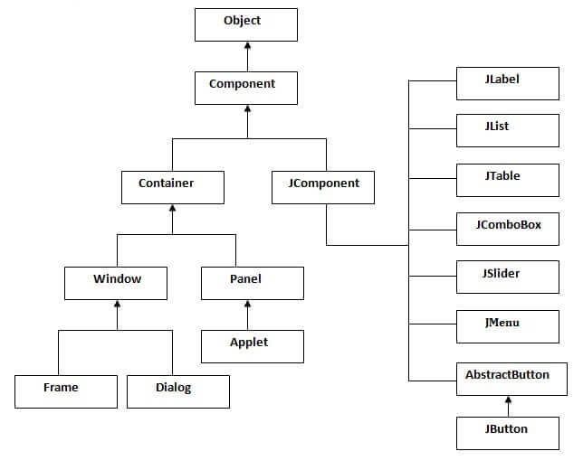

# GUIs!
- JFC: Java Foundation Classes
- JFC provides AWT and Swing for creating GUIs
- Swing is built on top of AWT (Abstract Windowing Toolkit)
- AWT was the old platform-dependent native library for GUIs in Java, swing is new, lightweight and platform-independent.
- [Read More](https://docs.oracle.com/javase/tutorial/uiswing/start/about.html)

## Swing Hierarchy

## JFrame
- JFrame is the canvas on which you draw the GUI by adding components.
- There are two ways for creating a JFrame:
    1. By creating the object of Frame class inside your main class `JFrameV1.java`
    2. By extending Frame class through your main class `JFrameV2.java`

## JPanel
- A container for multiple swing components
- A single JFrame can have multiple JPanels (think the editor, terminal and filetree in vscode, not that vscode is written in swing...)

## JComponent
- This is an abstract class, all GUI components extend this class.
- Checkout `swinghierarchy.jpeg`

## Colors
- `Colors.java`
- RGB Model:
    - Red-Green-Blue, each is a discrete number between 0 and 2^8 - 1 (8 bit colors)
    - 0-0-0 Absence of any colors (black)
    - 255-255-255 Presence of all the colors (white)
    - We have 2^8 * 2^8 * 2^8 = 16,777,216 colors!!
    - [The human eye can discriminate up to ten million colors](https://en.wikipedia.org/wiki/Color_depth)
- Some named color constants, color.BLUE, color.PINK, color.BLACK etc...

Good Resource: https://web.mit.edu/6.005/www/sp14/psets/ps4/java-6-tutorial/components.html
